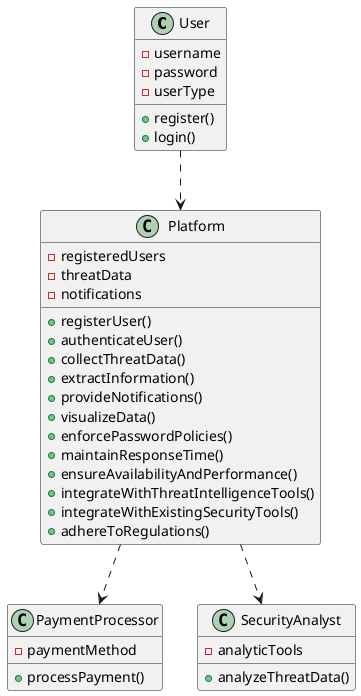
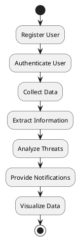
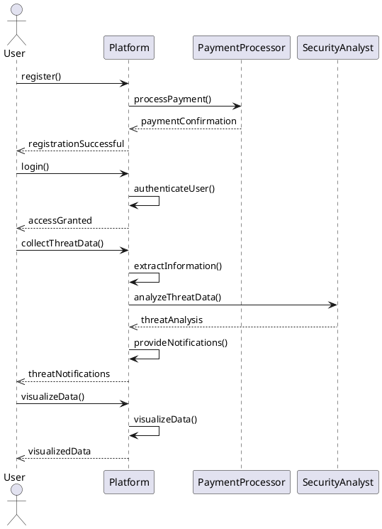
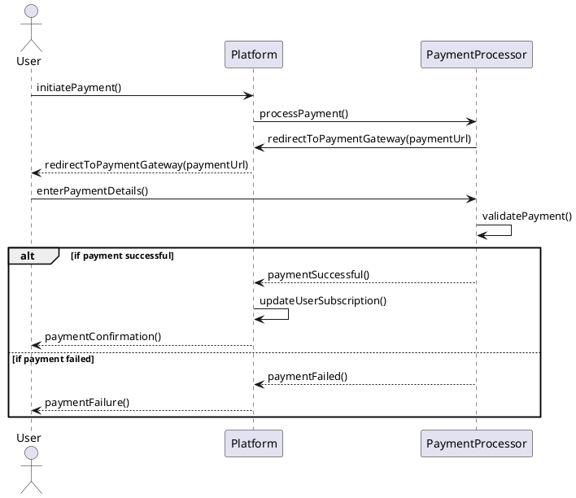
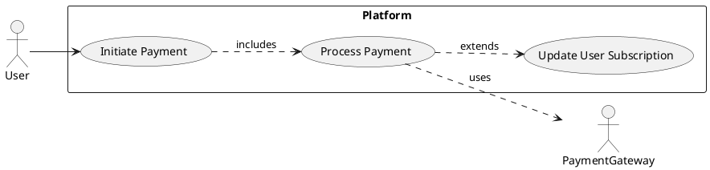
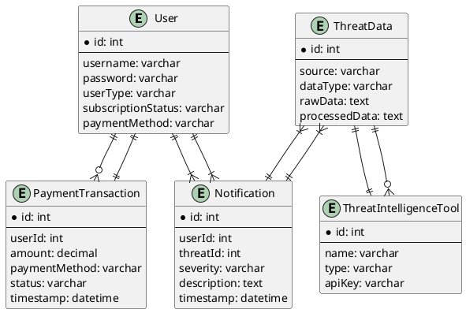

readme.md

Go to https://plantuml-editor.kkeisuke.com/# and paste the respective code block for the  diagram.

class diagram

activity diagram

sequence diagram

Sequence diagram for payment (stripe)

Use-case diagram for payment handling (stripe)

>In the sequence diagram, the user initiates the payment process on the platform, which then redirects the user to the payment processor (Stripe) for entering payment details. The payment processor validates the payment and sends the result back to the platform. Based on the result, the platform either updates the user's subscription or notifies the user about the payment failure.
In the use case diagram, the "Initiate Payment" use case is initiated by the user, which includes the "Process Payment" use case. The "Process Payment" use case uses the Payment Gateway (Stripe) and extends the "Update User Subscription" use case, which updates the user's subscription status if the payment is successful.

ERD

